<p align="center">
  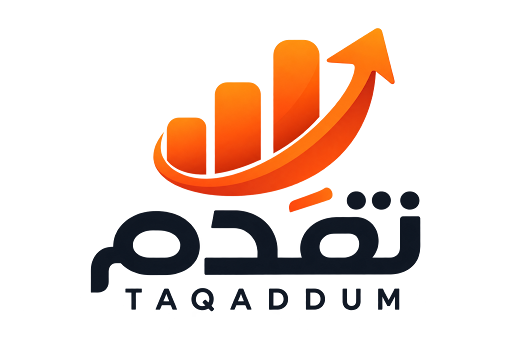
</p>

<h1 align="center">Taqaddum — تقدّم</h1>

<p align="center">
  Offline-first personal progress system for goals, habits and meaningful daily action.
</p>

<p align="center">
  
  
  
  
  
</p>

**Status: V1 development complete — release hardening in progress.**

Taqaddum is a private, offline-first Flutter application that turns long-term goals into
consistent daily progress. It brings goals, daily planning, Quran tracking, work,
finances, health, learning and personal reflection into one calm mobile experience.

All application data is stored locally on the device. Taqaddum does not need a server,
account service or internet connection for normal operation.

## App Preview

<p align="center">
  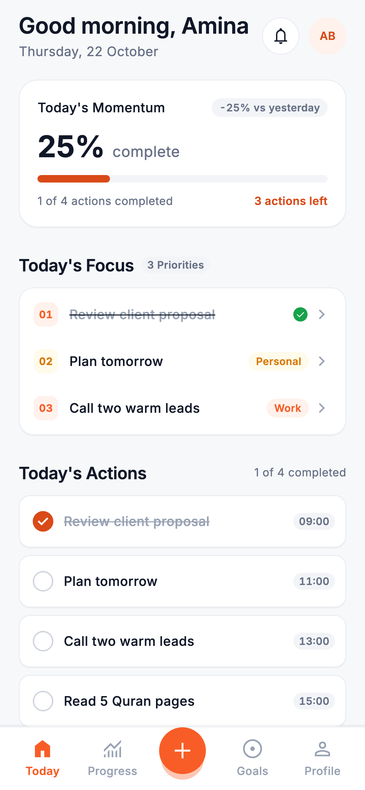
  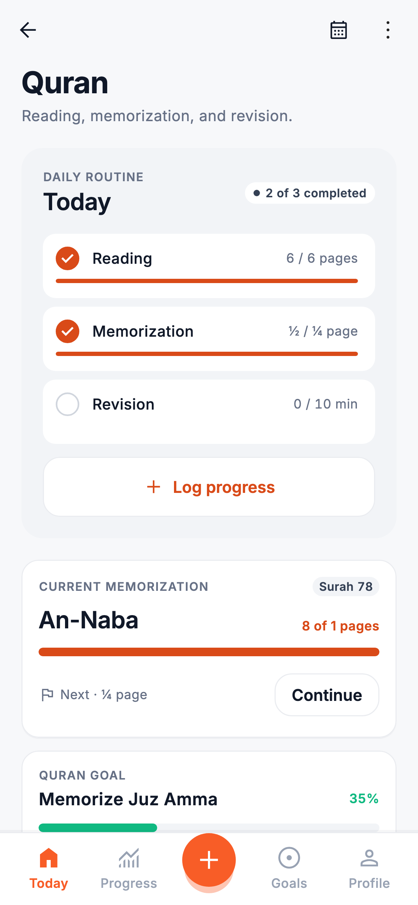
  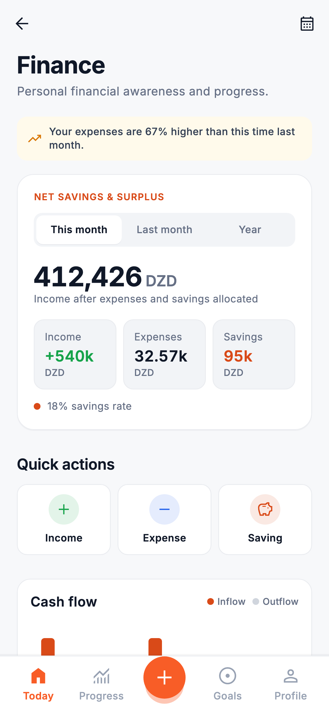
</p>
<p align="center"><sub>Daily planning · Quran progress · Finance awareness</sub></p>

<p align="center">
  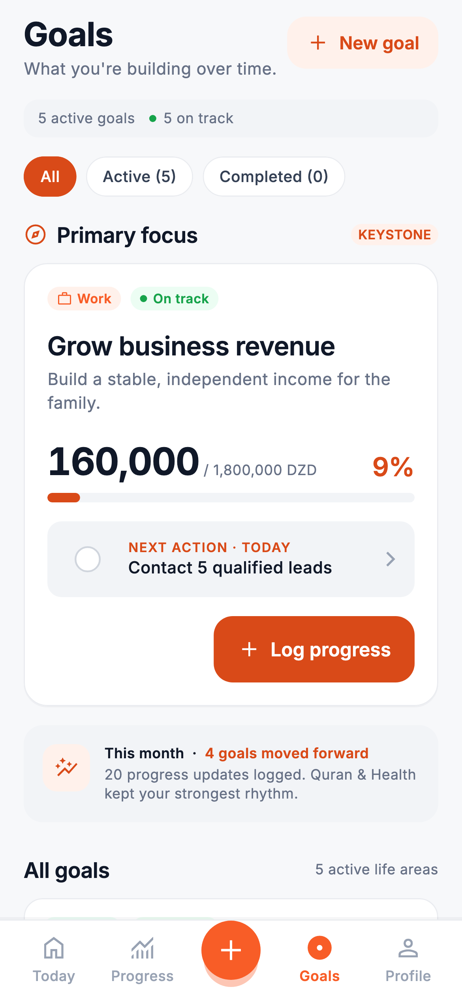
  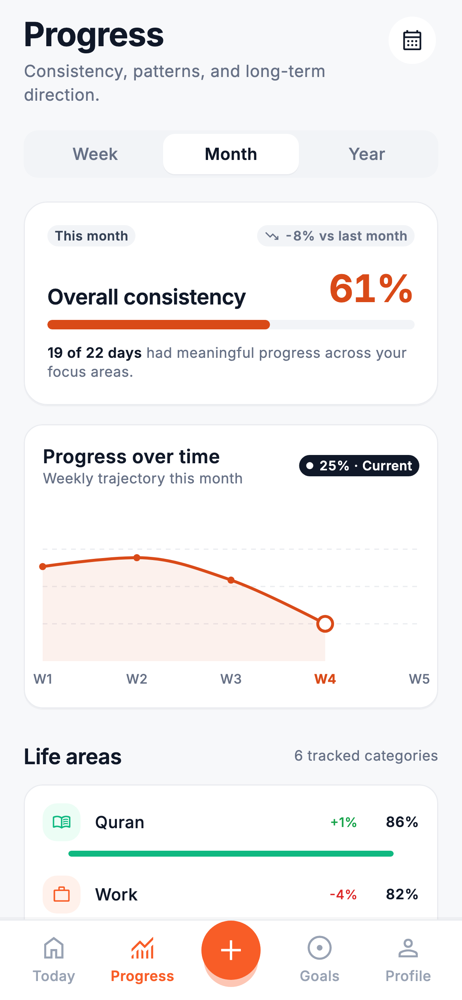
  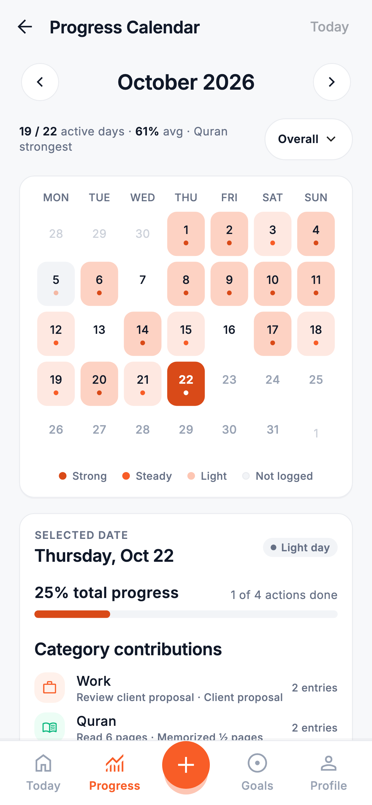
</p>
<p align="center"><sub>Goal tracking · Progress analytics · Consistency calendar</sub></p>

<p align="center">
  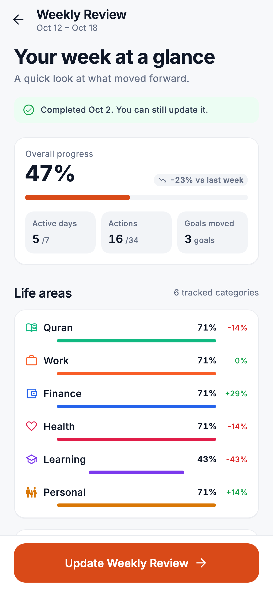
  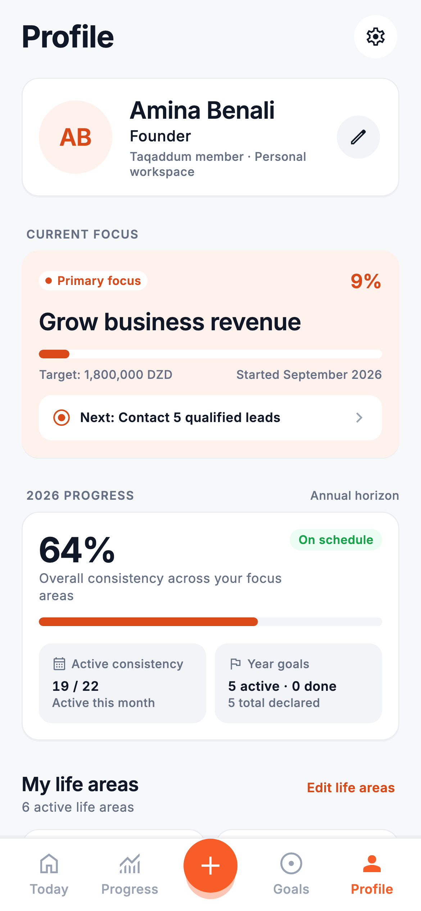
  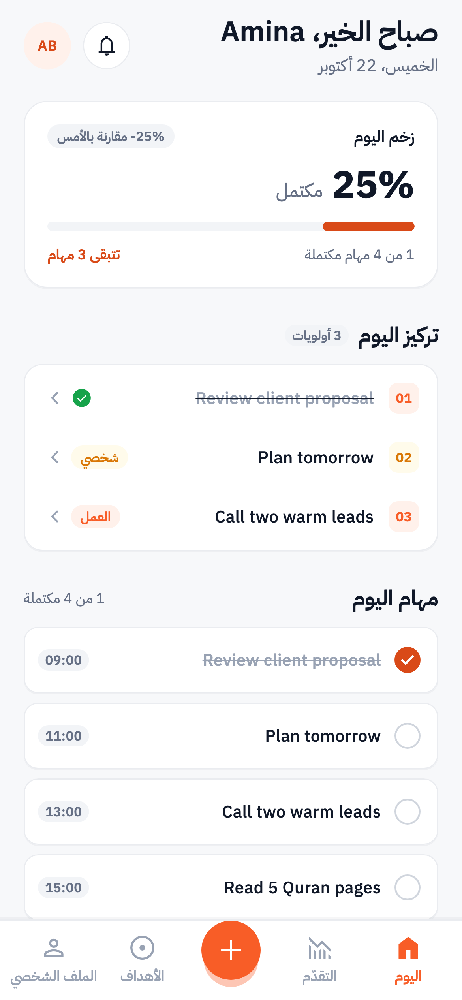
</p>
<p align="center"><sub>Weekly reflection · Profile · Arabic right-to-left</sub></p>

<details>
<summary>More screens</summary>
<p align="center">
  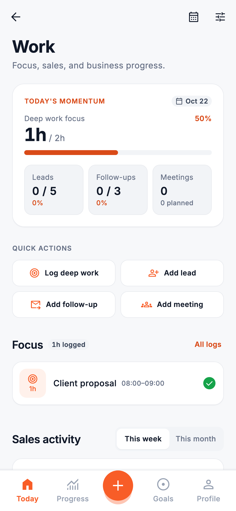
  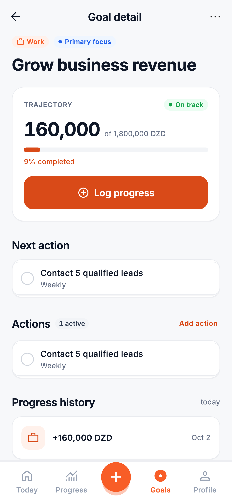
</p>
</details>

<sub>Screenshots are rendered from the Flutter app with its built-in demo data
(`tool/screenshots/capture_screenshots_test.dart`, 390 × 844 pt at 3×). Names and figures are
sample content.</sub>

## Key Features

### Daily System
- Morning check-in: energy, capacity, intention and up to three priorities
- Daily plan grouped by morning, afternoon and evening, with rescheduling
- Quick Add for tasks, Quran, money, work, habits and notes
- Night review with rating, reflection tags and moving unfinished actions to tomorrow

### Life Areas
- **Quran & Faith** — reading, memorization and revision with surah tracking
- **Work & Growth** — deep work, leads, follow-ups, meetings, proposals and clients won
- **Personal Finance** — income, expenses and savings with categories and cash flow
- **Health & Habits** — workouts, walks, sleep and daily habits
- **Learning** — study sessions, resources, a learning focus and applied takeaways
- **Personal Life** — personal goals, tasks and habits

### Goals & Progress
- Target, Routine and Milestone goals with a primary focus
- Goal-linked recurring actions; module logs move linked goals automatically
- Progress analytics by week, month and year, plus a progress calendar
- Weekly and monthly reviews with wins, gaps and next priorities
- Activity history with search, category and date filters

### Privacy & Offline
- Local SQLite database; no backend
- Local device account (salted password hash, or continue without a password)
- Local notifications with quiet hours and smart suppression
- JSON and CSV export through the system share sheet

## Offline-First by Design

- Goals, tasks, logs, reviews, reminders and settings are stored on the device in SQLite
  (Drift) and SharedPreferences.
- The app runs fully without internet. It includes no network, cloud, analytics or remote
  font packages, and fonts, icons and images are bundled.
- Statistics (goal progress, consistency, calendars, reviews, finance totals) are computed
  from stored records, not stored separately.
- Reminders are scheduled locally with `flutter_local_notifications`.
- **Export my data** writes a complete JSON backup or CSV files and hands them to the OS
  share sheet; nothing is uploaded by the app.
- The optional account password is stored only as a salted PBKDF2-HMAC-SHA256 hash in
  platform secure storage. The database itself is not encrypted.

## Tech Stack

| Area | Technology |
| --- | --- |
| UI / language | Flutter 3.47, Dart 3.13 |
| State | `flutter_riverpod` 3 |
| Navigation | `go_router` 18 |
| Database | `drift` + `drift_flutter` (SQLite) |
| Preferences / secrets | `shared_preferences`, `flutter_secure_storage`, `crypto` |
| Notifications | `flutter_local_notifications`, `timezone`, `flutter_timezone` |
| Charts | `fl_chart` |
| Export | `share_plus`, `path_provider` |
| Localization | `flutter_localizations` + gen-l10n (ARB), `intl` |
| Icons / fonts | `material_symbols_icons`; bundled Inter and IBM Plex Sans Arabic |

## Architecture

Feature-first structure. Each feature has `data/` (repositories), `domain/` (pure logic)
and `presentation/` (screens and widgets). Widgets never run SQL; multi-record writes use a
single transaction.

```
lib/
├── app/              MaterialApp, bootstrap
├── core/
│   ├── database/     Drift tables, migrations
│   ├── demo/         opt-in demo data seeder
│   ├── domain/       shared enums and period ranges
│   ├── localization/ l10n access, app locale
│   ├── routing/      GoRouter routes and guards
│   ├── services/     notifications, credentials, password hashing
│   ├── theme/        colors, typography, spacing, radius, motion tokens
│   ├── utilities/    formatting, search, bidi helpers
│   └── widgets/      shared components
├── features/
│   ├── auth/  onboarding/  splash/
│   ├── today/  goals/  progress/  reviews/  history/
│   ├── quran/  work/  finance/  health/  learning/
│   └── notifications/  profile/  settings/
└── l10n/             ARB catalogues and generated localizations
```

See [docs/architecture.md](docs/architecture.md) for the database model, state management
and offline strategy.

## Core Flow

```
Onboarding → Create goals → Plan today → Complete meaningful actions
           → Review the day → Track progress → Weekly / monthly reflection
```

<details>
<summary><strong>View the 24 primary screens</strong></summary>

| # | Screen | # | Screen |
| --- | --- | --- | --- |
| 01 | Splash | 13 | Health & Habits |
| 02 | Auth | 14 | Learning |
| 03 | Onboarding | 15 | Goals |
| 04 | Goal Setup | 16 | Goal Detail |
| 05 | Today | 17 | Progress |
| 06 | Morning Check-in | 18 | Progress Calendar |
| 07 | Daily Plan | 19 | Weekly Review |
| 08 | Quick Add | 20 | Monthly Review |
| 09 | Night Review | 21 | Activity History |
| 10 | Quran | 22 | Notifications |
| 11 | Work | 23 | Profile |
| 12 | Finance | 24 | Settings |

Routes and components per screen: [docs/screen_mapping.md](docs/screen_mapping.md).
</details>

## Quality & Testing

Development verification on the current codebase:

| Check | Result |
| --- | --- |
| `flutter analyze` | No issues |
| `flutter test` | 119 passing (72 unit, 21 data, 26 widget) |
| `flutter build apk --debug` | Successful |
| `flutter build ios --simulator` | Successful |

These are local development results, not a store release. The suite runs fully offline:

- **Unit** — goal progress, period ranges, progress calculator, review insights,
  finance/Quran/work statistics, reminder planning, password hashing, Arabic formatting
  and search
- **Data** — repositories on an in-memory database: local authentication, goals and linked
  logs, onboarding, demo seeder, JSON/CSV export, persistence, schema migration, language
  switching without data changes
- **Widget** — the real app on test doubles: every screen at 360 px and 430 px widths and at
  1.35× text size (any overflow fails), first-run flow, Quick Add, navigation, Arabic RTL
  screens and golden images

## Localization

- **English** and **Arabic (العربية, `ar_DZ`)** are complete: 1409 messages, Arabic plural
  rules, right-to-left layout and IBM Plex Sans Arabic typography.
- Digits stay Latin for amounts, percentages, dates and times; DZD shows as `150,000 دج`.
- The language can be switched in Settings at any time without touching stored data.
- French is listed as "coming in a future update" and cannot be selected yet.

Details: [docs/arabic_localization_review.md](docs/arabic_localization_review.md).

## Design System

A calm productivity look with an orange Taqaddum accent and a color per life area. Colors,
typography, spacing, radius and motion are tokens in `lib/core/theme/`, and screens are
built from shared components in `lib/core/widgets/`. Layouts are mobile-first and fit
360–430 px widths. The initial product design references were made separately and rebuilt
as native Flutter widgets ([docs/design_audit.md](docs/design_audit.md)).

## Getting Started

Prerequisites: Flutter stable (3.47+, includes Dart), Android Studio / Android SDK for
Android, Xcode for iOS (deployment target iOS 15) on macOS.

```bash
git clone https://github.com/zedclay/taqadum.git
cd taqadum
flutter pub get
flutter run
```

Generated Drift and localization code is committed. After changing Drift tables, run
`dart run build_runner build --delete-conflicting-outputs`.

**Demo data:** debug builds show **Settings → Developer → Load demo data**, which writes
35 days of sample history. Other builds enable it only with
`--dart-define=TAQADDUM_DEMO=true`; without it the app starts empty.

## Run the Checks

```bash
dart format --set-exit-if-changed .
flutter analyze
flutter test
dart run tool/l10n_audit.dart --strict
```

## Builds

```bash
flutter build apk --debug        # Android
flutter build ios --simulator    # iOS simulator
```

Release signing is not configured yet (Android release builds use the debug key and the
application id is still `com.example.taqadum`), so these are development builds only.

## Privacy

Taqaddum is built around local data storage. The current offline-first build does not
use a remote backend for application data, and the app includes no analytics or
tracking SDKs. Data stays on the device unless you export it. Uninstalling the app or
using **Delete account** removes the locally stored data, so export a copy first if you
want a backup.

## Roadmap

- Production release hardening (application id, release signing, store metadata)
- Validation on real Android and iOS devices
- Native-speaker review of the Arabic copy
- Android and iOS store preparation

## Documentation

- [Architecture](docs/architecture.md)
- [Screen mapping](docs/screen_mapping.md)
- [Design audit](docs/design_audit.md)
- [Arabic localization review](docs/arabic_localization_review.md)

## Author

Built by Bousbaa Abdelhafid / Skewes. Issues and feedback are welcome.

License not yet specified.
